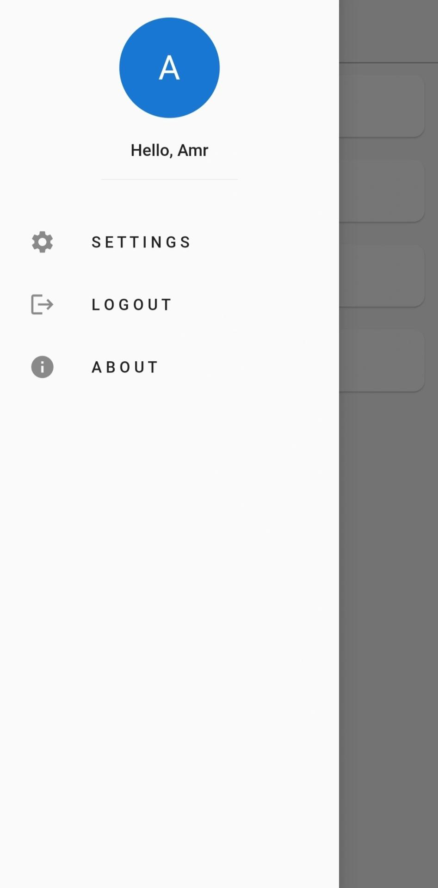

# Chatapp

This is a chat application built using Flutter and Firebase. It allows users to send messages and supports both dark and light modes. The application architecture is based on the Bloc and Cubit patterns.

To get started with the project, follow the steps below:

1. Clone the repository to your local machine.
2. Open the project in your preferred IDE.
3. Install the necessary dependencies by running `flutter pub get`.
4. Configure Firebase in your project by following the Firebase setup instructions.
5. Build and run the application on your desired device or emulator.

## UI Previews

